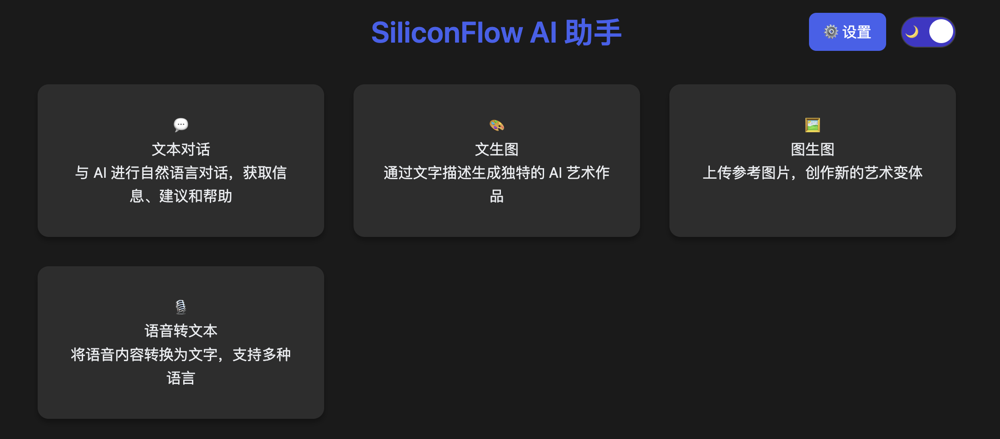

# SiliconFlow AI 助手

一个基于 SiliconFlow API 的多功能 AI 助手，支持 AI 对话、文生图、图生图和语音转文本等功能。

## 功能特点

### 1. AI 对话
- 支持与 AI 进行自然语言对话
- Markdown 格式渲染
- 支持复制对话内容（纯文本和 Markdown 格式）
- 代码高亮显示

### 2. 文生图
- 支持多种 AI 模型选择
- 可调节的图像生成参数
  - 引导比例（guidance scale）
  - 推理步数（inference steps）
  - 图像尺寸
  - 随机种子
- 支持正向和负向提示词
- 一键下载生成的图片

### 3. 图生图
- 支持拖拽上传图片
- 实时图片预览
- 可调节的变化参数
  - 变化强度
  - 引导比例
  - 推理步数
  - 图像尺寸
  - 随机种子
- 支持正向和负向提示词
- 一键下载生成的图片

### 4. 语音转文本
- 支持多种音频格式
- 支持拖拽上传音频文件
- 音频预览播放
- 一键复制转换结果
- 支持多语言识别

## 使用说明

### 1. 系统设置
- 在设置页面配置您的 SiliconFlow API Key
- API Key 安全存储在本地浏览器
- 支持深色/浅色主题切换

### 2. 模型选择
- AI 对话：支持多种对话模型
- 文生图：支持 FLUX、SD 等多种模型
- 图生图：支持 SDXL、SD 等模型
- 语音转文本：支持 SenseVoice 等模型

### 3. 参数调整
- 文生图/图生图参数：
  - 引导比例：1-20
  - 推理步数：1-50
  - 多种预设图像尺寸
  - 随机种子生成
- 图生图特有参数：
  - 变化强度：0.1-1.0

## 技术特点

### 1. 前端
- 纯原生 JavaScript 实现
- 响应式设计
- 深色模式支持
- 拖拽上传
- 实时预览

### 2. 后端
- Express.js 服务器
- API 代理转发
- 文件处理
- 错误处理
- 安全性保护

### 3. 安全性
- API Key 仅保存在用户本地
- 支持 HTTPS
- 启用了必要的安全头部
- 使用 helmet 增强安全性
- CORS 保护

### 4. 性能优化
- 图片压缩和优化
- Gzip 压缩
- 静态资源缓存
- 响应式图片加载

## 部署说明

### 1. 本地开发部署

```bash
# 安装依赖
npm install

# 开发环境运行
npm run dev

# 生产环境运行
npm run start
```

### 2. Vercel 部署

1. Fork 本项目到你的 GitHub 账户

2. 在 Vercel 中导入项目：
   - 登录 [Vercel](https://vercel.com)
   - 点击 "New Project"
   - 选择你 fork 的仓库
   - 点击 "Import"

3. 配置项目：
   - Framework Preset: 选择 "Other"
   - Build Command: `npm run build`
   - Output Directory: `dist`
   - Install Command: `npm install`

4. 环境变量设置（可选）：
   ```
   NODE_ENV=production
   PORT=8080
   ALLOWED_ORIGINS=your-domain.com
   ```

5. 点击 "Deploy" 开始部署

### 3. Docker 部署

1. 使用预构建镜像：
```bash
# 拉取镜像
docker pull your-registry/siliconflow-ui:latest

# 运行容器
docker run -d \
  -p 8080:8080 \
  -e NODE_ENV=production \
  -e ALLOWED_ORIGINS=your-domain.com \
  your-registry/siliconflow-ui:latest
```

2. 本地构建部署：
```bash
# 构建镜像
docker build -t siliconflow-ui:latest .

# 运行容器
docker run -d \
  -p 8080:8080 \
  -e NODE_ENV=production \
  siliconflow-ui:latest
```

3. Docker Compose 部署：

创建 `docker-compose.yml`:
```yaml
version: '3.8'
services:
  siliconflow-ui:
    build: .
    ports:
      - "8080:8080"
    environment:
      - NODE_ENV=production
      - ALLOWED_ORIGINS=your-domain.com
    restart: unless-stopped
```

运行：
```bash
docker-compose up -d
```

### 4. 反向代理配置

#### Nginx 配置示例：
```nginx
server {
    listen 80;
    server_name your-domain.com;

    location / {
        proxy_pass http://localhost:8080;
        proxy_http_version 1.1;
        proxy_set_header Upgrade $http_upgrade;
        proxy_set_header Connection 'upgrade';
        proxy_set_header Host $host;
        proxy_cache_bypass $http_upgrade;
    }
}
```

#### Apache 配置示例：
```apache
<VirtualHost *:80>
    ServerName your-domain.com
    ProxyPreserveHost On
    ProxyPass / http://localhost:8080/
    ProxyPassReverse / http://localhost:8080/
</VirtualHost>
```

### 5. HTTPS 配置

1. 使用 Let's Encrypt：
```bash
# 安装 certbot
sudo apt-get install certbot python3-certbot-nginx

# 获取证书
sudo certbot --nginx -d your-domain.com
```

2. 手动配置 HTTPS：
```nginx
server {
    listen 443 ssl;
    server_name your-domain.com;

    ssl_certificate /path/to/cert.pem;
    ssl_certificate_key /path/to/key.pem;

    # ... 其他配置
}
```

## 部署注意事项

1. 安全性配置：
   - 设置适当的 CORS 策略
   - 配置安全的 HTTP 头部
   - 启用 HTTPS
   - 设置访问控制

2. 性能优化：
   - 启用 Gzip 压缩
   - 配置缓存策略
   - 使用 CDN 加速静态资源

3. 监控和日志：
   - 配置错误日志
   - 设置性能监控
   - 配置告警机制

## 环境要求

- Node.js >= 14.0.0
- NPM >= 6.0.0
- 现代浏览器支持

## 故障排除

1. API Key 相关问题
   - 确保已在设置页面正确配置 API Key
   - 检查 API Key 是否有效

2. 图片生成问题
   - 检查网络接
   - 确认提示词是否合适
   - 查看浏览器控制台错误信息

3. 音频转换问题
   - 确认音频格式是否支持
   - 检查文件大小是否超限

## 更新日志

### v1.0.0
- 初始版本发布
- 支持基础对话功能
- 支持文生图功能

### v1.1.0
- 添加图生图功能
- 优化用户界面
- 添加深色模式

### v1.2.0
- 添加语音转文本功能
- 重构设置页面
- 优化错误处理
- 改进文档

## 许可证

MIT License